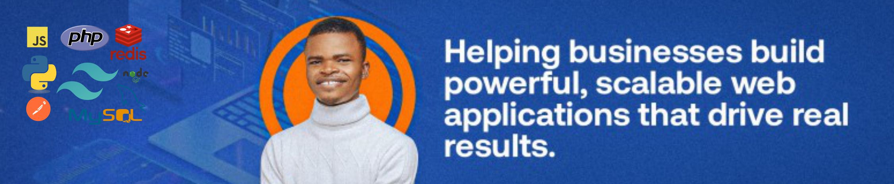

# Hello World!, I'm Goodluck, a web developer 👋🏼:

🚀 Currently working on AI-powered digital solutions 💻 passionate about backend development, machine learning, and so much more 👨🏼‍💻 working as a web developer since 2022  🎯 focused on building scalable and efficient systems 🎙 Exploring AI-powered voice technologies 📍 Open to exciting projects and collaborations

# 💻 Tech Stack:

                                     

## 💡 Random Dev Quote:

<picture>
  <source media="(prefers-color-scheme: dark)" srcset="https://raw.githubusercontent.com/mantle-bearer/mantle-bearer/output/github-snake-dark.svg" />
  <source media="(prefers-color-scheme: light)" srcset="https://raw.githubusercontent.com/mantle-bearer/mantle-bearer/output/github-snake.svg" />
  
</picture>
